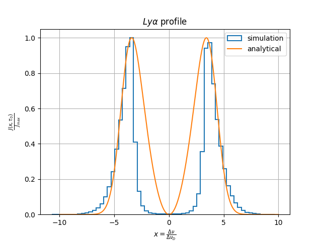
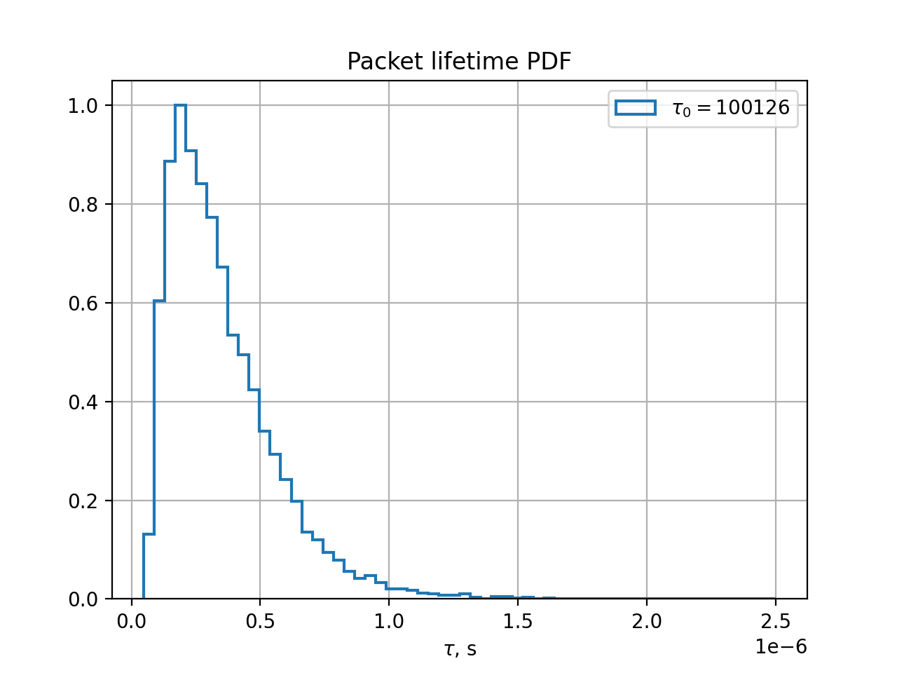
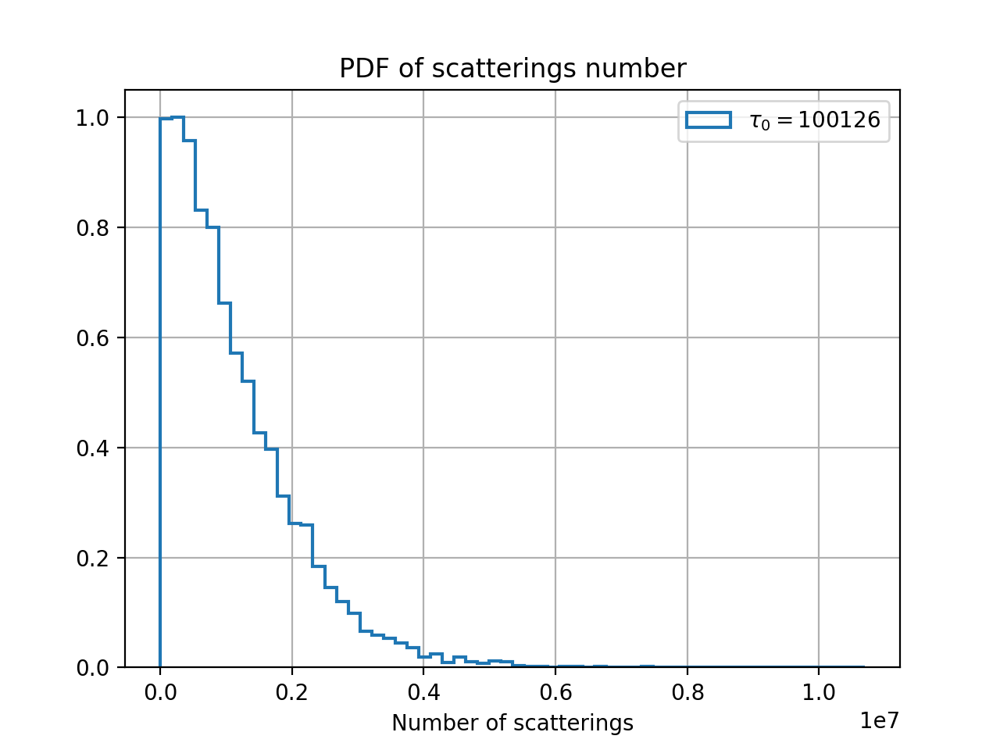

# Моделирование рассеяния $Ly\alpha$ фотонов в гомогенной сфере

&nbsp;
## Постановка задачи
Дана сфера радиуса $R$ с постоянным значением плотности $n$ и температурой $T$. При распространении в сфере фотоны могут претерпевать *только* рассеяния. Главный, интересующий нас, выходной параметр - среднее время жизни фотона при данных $R,n,T$.

В качестве рассеяния выбирается приближение частично когерентного изотропного рассеяния.

Все величины здесь и в коде выражены в системе СИ.

### Список используемых констант:
* Скорость света: $c = 299792458$  $м/c$
* Постоянная Больцмана: $k = 1.380649 \cdot 10^{-23}$ $Дж/К$
* Масса протона: $m_p = 1.67262192369\cdot 10^{-27}$ $кг$
* Масса электрона: $m_e = 9.1093837\cdot 10^{-31}$ $кг$
* Заряд электрона: $e = −1.60217\cdot 10^{-19}$ $Кл$
* Длина волны $Ly\alpha$: $\lambda_a = 121.567\cdot 10^{-9}$ $м$
* Частота фотона $Ly\alpha$: $\nu_a = 2.4661\cdot 10^{15}$ $Гц$

**Параметры для функции Фойгта:**
* Доплеровское сечение поглощения: $\sigma_D = 5.9\cdot 10^{-18}$ $м^2$ [Khodachenko et al. 2017]
* Естественное сечение поглощения: $\sigma_N = 2.6\cdot 10^{-23}$ $м^2$ [Khodachenko et al. 2017]
* Параметр Фойгта: $a = 4.70574\cdot 10^{-2}\cdot T^{-1/2}$  

&nbsp;
## Частично когерентное изотропное рассеяние
### Подход M. Dijkstra
Полный вывод всех формул и подробное описание: **Mark Dijkstra et al. Physics of Lyα Radiative Transfer, 2019 (DOI: 10.1007/978-3-662-59623-4_1)**

В большинстве астрофизических условий возбужденный на $2p$ уровень атом водорода не претерпевает никаких событий в течение времени жизни уровня $t\approx 10^-9$ с. следовательно энергия переизлученного фотона не меняется. Но при тепловых движениях атома сохранение энергии в системе отсчета атома приводит к изменению энергии исходящего фотона, которая зависит от скорости атома и направления рассеяния.

Введем обозначения. Вместо обычной частоты будем использовать безразмерную частоту фотона $x = (\nu-\nu_a)/\Delta\nu_D$. Здесь $\Delta\nu_D$ - допплеровская ширина линии.
$$\Delta\nu_D = v_{th}\frac{\nu_a}{c}=\sqrt{\frac{2kT}{m_p}}\frac{\nu_a}{c}$$
В коде в основном используется не частота, а доплеровская скорость атома, на котором происходит рассеяние: $\Delta v = v_{th}x$. Полезное соотношение для перевода скоростей в размерные частоты:
$$\nu = \frac{\nu_a}{1+\frac{\Delta v}{c}} = \frac{\nu_a}{1+\frac{\Delta v_{th}x}{c}}$$

При рассеянии выходная частота фотона окажется равной (все величины в лабораторной с.о.)
$$x_o = x_i -\frac{\bf v\cdot k_i}{v_{th}} + \frac{\bf v\cdot k_o}{v_{th}}$$
где $\bf v$ и $\bf k$ - скорость атома и волной вектор, здесь мы также пренебрегли эффектом отдачи.

Если векторы направления распространения фотона до и после события $\bf n_i$ и $\bf n_o$, то введем параметр $\mu = \bf n_i \cdot n_o = cos(\theta)$,  $\theta$ - поярный угол. При рассмотрении поперечных и продольных компонент скорости относительно направления фотона выражение для частоты приводится к виду
$$x_o = x_i -u + u\mu + w\sqrt{1-\mu^2}$$
$$u = v_{\parallel}/v_{th}$$
$$w = v_{\perp}/v_{th}$$

Таким образом, если мы знаем направление распространения фотона, и скорости атома, то мы легко найдем частоту фотона после рассеяния в ЛСО.

### Подход K.Seon
Существует немного отличающийся подоход к обработке рассеяния **Kwang-il Seon and Chang-Goo Kim ApJS 250 9, 2020 (DOI:10.3847/1538-4365/aba2d6)**

Частота фотона после рассеяния находится следующим образом:
$$x_o=x_i-u+\bf{n_0\cdot v_{atom}}-g(1-\mu)$$
Последнее слагаемое отвечает за эффект отдачи и $g=2.536\cdot 10^{-4} \left(T/10^4 \right)^{-1/2}$

А $\bf v_{atom}$ - вектор скорости атома. $\bf{ v_{atom}} = (u, u_{\perp1}, u_{\perp2})$

Здесь $u$ определяется как и для метода Dijkstra, а поперечные компоненты как описано ниже.

### Как определить скорости атома
**Продольная компонента**

Величина $u$ подчиняется плотности распределения вида:
$$f(u) = \frac{a}{\pi H(a, x)} \frac{e^{-u^2}}{(x-u)^2 + a^2}$$
здесь $H(a, x)$ - функция Фойгта, равная свертке Гауссовой и Лоренцевой функций.
$$H(a, x)  = \frac{a}{\pi} \int_{-\infty}^{\infty} \frac{e^{-y^2}}{(x-y)^2 + a^2} dy$$

**Поперечная компонента**

Величина $w$ подчинается плотности распределния вида:
$$f(w) = \frac{1}{\sqrt\pi} e^{-w2}$$
т.е. имеет нормальное распределение при мат.ожидании $M=0$ и СКО $\sigma = \sqrt{1/2}$

Так, для определения скоростей атома необходимо выбрать $u$ и $w$ из соответсвующих распределний. Методы выборки см. в разделе *Монте Карло подход к рещению задачи*

&nbsp;
## Монте Карло подход к решению задачи
Подробное описание метода:
* **U. M. Noebauer, M. A. Sim Monte Carlo Radiative Transfer, 2019**
* **O. N. Vassiliev Monte Carlo Methods for Radiation Transport, 2017**

Для решения задачи используется метод Монте Карло. Краткая суть метода: вместо решения уравнения переноса моделируется сам процесс переноса. В среду запускаются модельные фотоны - пакеты. Каждый пакет имеет координаты, направление распространения, частоту и флаг активности. Параметры выбираются в соответсвтии с решаемой задачей. Чтобы моделировать перенос излучения для каждого пакета случайно выбирается оптический путь, который пакет пройдет, в точке пр-ва, соответвующей оптическому пути пакет рассеивается и обновляются его частота и направление. После чего процесс повторяется пока пакет не покинет область расчета. Как только все пакеты покинут область расчета моделирование заканчивается. Результирующие выходные параметры рассчитываются на основе статистики пакетов.

### Алгоритм расчета

Здесь и далее обозначим буквой $\xi$ случайную величину равномерно распределенную на промежутке $[0,1]$. В коде она выбирается на основе вихря Мерсена (**C++: std::mt19937**).

1) **Инициализация пакетов**

Перед началом расчета задается кол-во моделируемых пакетов $N_p$, радиус сферы $R$ в [м], температура сферы $T$ в [K] и концентрация частиц $n$ в [$м^{-3}$] (*constants.h*). Координаты всех пакетов $(x,y,z)=(0,0,0)$. По умолчанию частота каждого пакета $\nu = \nu_a$, в коде это параметр $v=0$ - скорость атома в [м/с]. Направление распространения $n = (nx, ny, nz)$ выбирается на основе изотропного распределения (см. ниже). У каждого пакета есть флаг активности *is_active* - ему присваивается *true*.

2) **Процесс распространения**

Для каждого пакета определяется оптический путь, который ему предстоит пролететь до точки рассеяния: $\tau = -ln(\xi)$.

Этот оптический путь необходимо перевести в физическое расстояние (*mcrt.h::calc_distance2event()*). В общем виде (здесь $x$ - частота)
$$\tau = \int_0^l \sigma(x) n ds$$
где $\sigma(x)$ - сечение поглощения $Ly\alpha$ фотона. Его явный вид:
$$\sigma(x) = f_{12}\frac{\sqrt{\pi}e^2}{m_e c \Delta\nu_D} H(x, a)$$

В коде используется приближенное значение [Khodachenko et al. 2017, Tasitsiomi 2006]:
$$H(a, x) \approx e^{-x^2} + \frac{a\cdot q(x^2)}{x^2\sqrt{\pi}} \Rightarrow$$
$$\sigma(x, \Delta v, T) \approx \sigma_D \sqrt{10^4/T}\cdot e^{-x^2} + \sigma_N \left( \frac{10^5}{\Delta v} \right)^2\cdot q(x^2)$$

$$z(x^2) = \frac{x^2 - 0.855}{x^2+3.42}$$
$$q(x^2) = 0,z(x^2) \leq 0 \: или \: \Delta v =0$$
$$q(x^2) = \frac{21+x^2}{1+x^2}z(x^2)\cdot (0.1117+z(x^2)(4.421 + z(x^2)(5.674z(x^2)-9.207)))$$

Заметим, что рассматриваемая среда статична, значит при распространении частота фотона не меняется и характеристики среды тоже поэтому сечение поглощения не должно зависеть от пути: $\partial\sigma(x)/\partial s = 0 \Rightarrow$
$$\tau = \sigma(x)n\int_0^lds = \sigma(x)nl$$
$$l = \frac{\tau}{n\sigma(x)}$$

После этого обновляюься координаты пакета:
$$x' = x + ln_x$$
$$y' = y + ln_y$$
$$z' = z + ln_z$$
и обновляется общая длина траектроии пакета: $l_{new} = l_{old} + l$

Далее следует проверка, вылетел ли пакет. Если $\sqrt{x'^2 + y'^2 + z'^2} > R$ - пакет вылетел и его флаг *is_active=false*.

В другом случае происходит рассеяние по Dijkstra (*mcrt.h::PIC_scatter()*) или по Seon (*mcrt.h::PIC_scatter_seon()*).

Выбирается новое направление $n' = (n_x', n_y',n_z')$. Оно выбирается либо из изотропного распределения (простой вариант, но менее точный), либо из фазовой функции Рэлея (более точный вариант) см ниже.

 Расчитывается $\mu = \bf n\cdot n'$. Генерируются скорости $u$ и  $w$, и на их основе вычисляется выходная частота фотона $x_o$, которая переводится в доплеровскую скорость атома $\Delta v = x_o v_{th}$.

3) **Окончание расчета**

После шага 2) подсчитывается общее число активных пакетов $N_a$, если оно не равно 0, то снова повторяется шаг 2) и так до тех пор, пока не станет $N_a=0$. После этого, характеристики пакетов записваются в файл.

&nbsp;
## Выборка из распределений

### Выборка направления распространения из изотропного распределения

Изотропное распределение предполагает равномерный выбор координат $\theta$ и $\phi$ на единичной сфере, которые можно перевести в координаты единичного вектора направения $n$.

Если $\xi_i \in [0,1]$ - равномерно распределенная случайная величина, то
$$\phi = 2\pi\xi_1$$
$$\theta = arccos(2\xi_2-1)$$
тогда
$$n_x = sin(\theta) cos(\phi)$$
$$n_y = sin(\theta) sin(\phi)$$
$$n_z = cos(\theta)$$

### Выборка направления распространения из Рэлеевской фазовой функции

Рэлеевская фазовая функция очень похожа на диаграмму направленности диполя. Она имеет плотность распределения $P(\theta)\approx 1 + cos^2(\theta)= 1 + \mu^2$.
Выборка из знакопеременной плотность нетривиальна и требует детального рассмотрения см. [С. М. Ермаков Статистическое моделирование, 1982].

Выбор направления производится следующим образом, если $\xi_i \in [0,1]$
$$\phi = 2\pi\xi_1$$
$$\mu = \left( 2(2\xi_2-1)+\sqrt{4(2\xi_2-1)^2+1} \right)^{1/3}-\left( 2(2\xi_2-1)+\sqrt{4(2\xi_2-1)^2+1} \right)^{-1/3}$$
$$\theta = arccos(\mu)$$
и тогда
$$n_x = sin(\theta) cos(\phi)$$
$$n_y = sin(\theta) sin(\phi)$$
$$n_z = cos(\theta)$$


### Выборка скоростей атома

В случае, когла нам известна функция плотности распределния осуществить выборку можно  методом выборки с отклонением или его модификацией - метод фон Неймана.

Для того, чтобы выбрать величину $x$ из распределения $f(x)$ ($f(x)$ неинтегрируема, иначе выборка тривиальна) нужно выбрать функцию $g(x)| g(x)\geq f(x)$. $g(x)$ должна быть такой, чтобы из нее можно было легко выбрать случайную величину.

1) Выбираем величины $\gamma$ из $g(x)$ и $\xi\in [0,1]$.
2) Если $\xi \leq {f(\gamma)}/{g(\gamma)}$, то возвращаем $\gamma$
3) В другом случае генерируем новые $\gamma$ и $\xi$.

**Выбор $w$**

Выбор стандартными средствами C++
```
std::mt19937 mt{ std::random_device{}() };
std::normal_distribution<> norm_dist{ mean, sigma };
double x = norm_dist(mt);
```

При этом, чтобы получить выборку из распределния Максвелла по скоростям $mean=0$ и $sigma =\sqrt{1/2}$ 

**Выбор $u$ методом из Zheng**
1) **Zheng Zheng and Jordi Miralda-Escude´, 2002, ApJ 578:33-42 (Appendix)**
2) **P. Laursen Interpreting Lyman α radiation
from young, dusty galaxies, 2010**

Выборка $u$ из распределения (константа перед выражением не влияет на результат, поскольку сократиться в процессе расчета)
$$f(u) = \frac{e^{-u^2}}{(x-u)^2 + a^2}$$
В качестве $g(u)$ выберем

Если $u\leq u_0$:
$$g(u)=\left( (x-u)^2+a^2 \right)^{-1}$$
Если $u>u_0$:
$$g(u)=e^{-u_0^2}\left( (x-u)^2+a^2 \right)^{-1}$$

 Введем:
 $$p = \int_{-\infty}^{u_0}g(u)du/\int_{-\infty}^{\infty}g(u)du =
 \frac{\theta_0 + \pi/2}{\theta_0 \left( 1 - e^{-u_0^2}\right) + \left( 1 + e^{-u_0^2}\right)\pi/2}$$
 $$\theta_0 = arctg((u_0-x)/a)$$

 Генерируем $\xi_1, \xi_2, \xi_3$.

 Если $\xi_1\leq p$: $\theta = \xi_2(\theta_0+\pi/2)-\pi/2$ и $u =a\cdot tg(\theta) + x$, тогда если $\xi_3 < e^{-u^2}$, $u$ принимается (иначе повторяем).

 Если $\xi_1> p$: $\theta = \xi_2(\pi/2 - \theta_0)+\theta_0$ и $u =a\cdot tg(\theta) + x$, тогда если $\xi_3 < e^{-u^2}/e^{-u_0^2}$, $u$ принимается (иначе повторяем).

Процент отклоненных точек зависит от выбора $u_0$. Можно выбрать $u_0=3$, такое значение дает неплохой результат.

В 2) (стр. 78) описан другой выбор $u_0$:

Если $0\leq x <0.2$, то $u_0=0$

Если $0.2\leq x <x_c(a)$, то $x-0.01a^{1/6}e^{1.2x}$

Если $x\geq x_c(a)$, то $u_0=4.5$

В целом оба варианта работают одинаково быстро, второй вариант всего на 6% быстрее первого.

**Выбор $u$ методом из Seon**

1) **Kwang-il Seon and Chang-Goo Kim ApJS 250 9, 2020 (Appendix)**

Описанный метод Zheng-a все еще дает много отклоненных точек. Seon придумал более эффективный метод. Метод достаточно сложен, поэтому не будем писать его алгоритм здесь.

Скажем, что необходимо комбинировать оба метода сразу. При $x<1$ - метод Zheng-а, в ином случае метод Seon-a.

**Выбор $u_{\perp1}, u_{\perp2}$**

Поперечные скорости выбираются аналогично $w$, но из двумерного распределния Максвелла по скоростям.

$$u_{\perp1}=\sqrt{-ln(\xi_1)}cos(2\pi\xi_2)$$
$$u_{\perp2}=\sqrt{-ln(\xi_1)}sin(2\pi\xi_2)$$

&nbsp;
## Тестовый расчет

Все фотоны инициализироваль на частоте $\nu_a$ ($\Delta v= 0$). 

$R=12 м$, 

$T=2\cdot 10^4К$, 

$n = 2\cdot 10^{22}м^{-3}$.

В книге Mark Dijkstra, Physics of Lyα Radiative Transfer описано приближенное аналитическое решение задачи.

Введем оптическую глубину сферы для центральной линии и столбец плотности:
$$\tau_0=\sigma(x=0)N$$
$$N = nR$$

Частота на которой должны наблюдаться центральные максимумы:
$$x_p = \pm 0.92\left( a\tau_0/\sqrt\pi\right)^{1/3}$$

Среднее время жизни фотона в сфере:
$$t_{trap} = |x_p|\frac{R}{c}$$

Среднее число рассеяний:
$$N_{scat} = 0.6\tau_0\\$$

Аналогичные соотношения вывел  [**Tasitsiomi, 2006**]
$$x_p = \pm 0.881\left( a\tau_0\sqrt\pi\right)^{1/3}$$
$$t_{trap} = |x_p|\frac{R}{c}$$
$$N_{scat} = 0.909\tau_0\sqrt\pi$$


Решение для интенсивности, усредненной по телесному углу [**M. Dijkstra, Z. Haiman M. spaans Lyα radiation from collapsing protogalaxies I:
characteristics of the emergent spectrum, 2006**]:
$$J(\tau_0, x)  = \frac{\sqrt\pi}{\sqrt{24}a\tau_0}  \frac{x^2}{1+ch\left( \sqrt{\frac{2\pi^3}{27}} \frac{|x^3|}{a\tau_0}\right)}$$
здесь определение $\tau_0$ отличается от приведенного выше:
$$\tau_0 = 5.9 \cdot 10^6 \cdot \frac{nR\cdot 10^2 cm}{10^{20}cm^{-2}} \cdot \left(T/10^4\right)^{-1/2}$$

### Результаты расчета
Запускалось 10 000 пакетов

При наших параметрах $\tau_0 = 10^6$ (в нашем определении).

|Величина |Теория (Dijkstra) |Теория (Tatitsiomi) | Расчет|
|-|-|-|-|
|$x_p$|5.27 |5.05| 6.4|
|$t_{trap}$ |$2.11\cdot10^{-7}$ |$2.02\cdot10^{-7}$| $3.51\cdot10^{-7}$|
| $N_{scat}$|600 000 |1 600 000| 1 110 000 |









## Частотная и пространственная диффузия

В начале, когда все фотоны лежат в центре линии, происходит быстрая частотная диффузия, длина свободного пробега очень маленькая. В результате фотоны не покидают сферу, а смещаются в крылья профиля излучения. Для фотонов в крыльях наблюдается пространственная диффузия и большая длина свободного пробега (в десятки раз выше чем в центре линии), именно здесь фотоны покидают сферу.

Длина свободного пробега оценивается как:
$$l\approx \frac{\sqrt\pi}{\tau_0 a} x^2$$

Фотоны, находящиеся в крыльях могут вернуться в центр линии, но для это им нужно совершить примерно $x^2$ рассеяний, так как длина свободного пробега большая, в большинстве случаев они не успевают вернуться и вылетают из сферы.

Если обозначить положение максимумов спектра $|x_p|$, то фотоны с частотами $x<|x_p|$ стремятся к центру линии и с меньшей вероятностью покидают сферу (частотная диффузия). Фотоны с $x>|x_p|$ вылетают легче, и с ростом $x$ таких фотонов все меньше, т.к. длина свободного пробега растет и фотоны вылетают из сферы.
